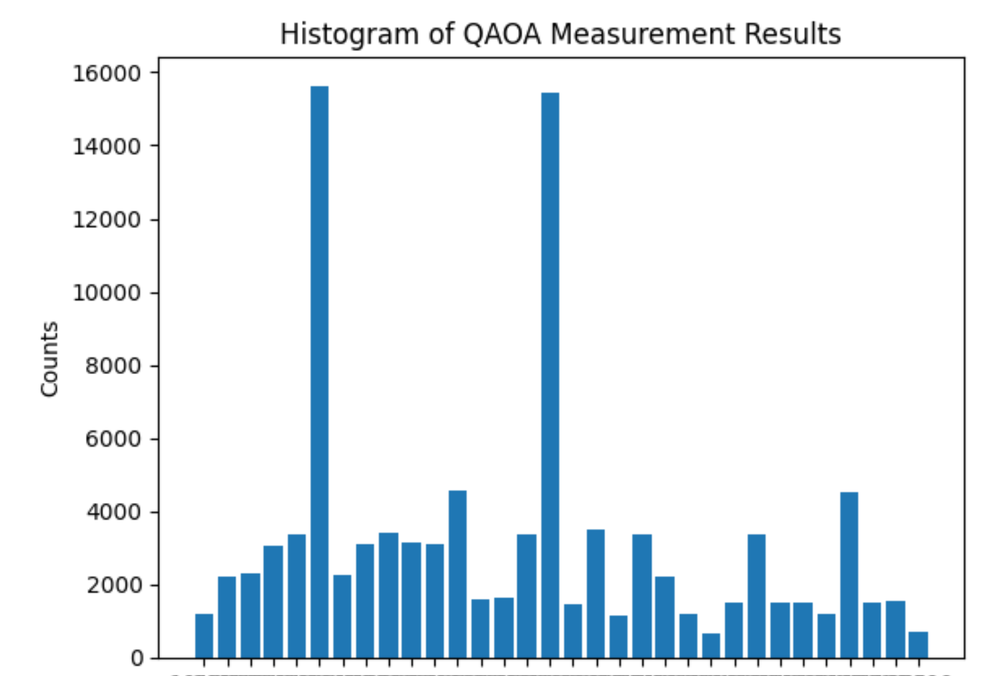

# Documentation For Qhack, Team SIJ

## Introduction to the task
The brief provided us with the option of two problems; to break into a vault in a bank protected by a high tech security system modelled by a complex graph, or, assuming a successful heist, evade the police whilst escaping with their task force to catch us being modelled by a dynamic graph. We opted for the former of the problems and chose to use the max cut method to disable key security nodes, maximising our chance of a successful heist.
## Narrative
The infamous bank robbing conglomerate team SIJ have their sites set on a new bank. Their strategy is as follows: member J and member S will enter the building whilst member I will remain in their portable hack-van. Member I will attempt to shut down the variety of security systems protecting the bank, ensuring members J and S have the best chance of reaching the money as possible...
## Problem description
The effectiveness of any one of the bank's security systems is attached a 'weight' value, which corresponds to the edge weight of this security system in a graph. By 'cutting' one of these edges, the associated security system is rendered ineffective, thus improving our chances of reaching the money without being caught. By maximising the total weight of the edges, we maximise our chance of success. But there is a catch... if, after the cuts have been made, more than one 'node' (security system hub) remains disconnected from the rest of the security network, the building's central system assumes work case scenario (it is under attack!) and collapses the building ontop of the money... and anyone in it.

## Graph
The graph below represents one particular bank in town that criminal mastermind gang SIJ were going after:
]
The nodes are different rooms or corridors in the bank and the edges doors between them, with the weights representing the number and complexity of digital security measures blocking access between the rooms.

The highlighted edges here show where we'd cut the graph to for our technical remote team to knock-out as many security systems as possible, to enable our man on-the-ground to get to the vault on node 4.
## Initial Rabbit Hole
We went down a big rabbit trail in the first half of the hackathon, trying to adapt the classical max-cut algorithm provided in the hackathon brief. We did two things:
1. Added support for weighted edges (previously it was only counting the edges but not taking into account the weights)
2. Added logic to only consider a partitioning valid if the individual partition graphs were connected

We used this classical algorithm to help verify the correctness in the quantum approach.

We also plotted the graph to help us visually verify the results of the classical algorithm, e.g.:
]

## Quantum Solution
### Approach
We modified the standard max-cut QUBO to incorporate weighted edges. This accounts for the more highly secured parts of the bank.

We also incorporated a condition to "discourage" partitionings where all the nodes of the resulting partitions were not connected to each other (due to all edges being cut). In the QUBO, we incorporated an isolation penalty for partitions where a partition had at least two 0-degree nodes (i.e. no edges coming out).
### Implementation
The full implementation can be found in `QHack2025.ipynb`. Take special note of the QUBO implementation adaptations / additional constraints in `graph_to_qubo` function (i.e. isolation penalty).

For the QAOA algorithm results, we plotted the these on a histogram with 100000 shots. See the figure below (bitstrings not shown):
]

The results tended towards the correct answer though would often lead to ineligible partitions. In order to counteract this we implemented an isolation penalty that would apply a negative weighting to nodes with no edges. This addition decreased the number of ineligible cuts but did not otherwise increase the accuracy of the result of the model.
